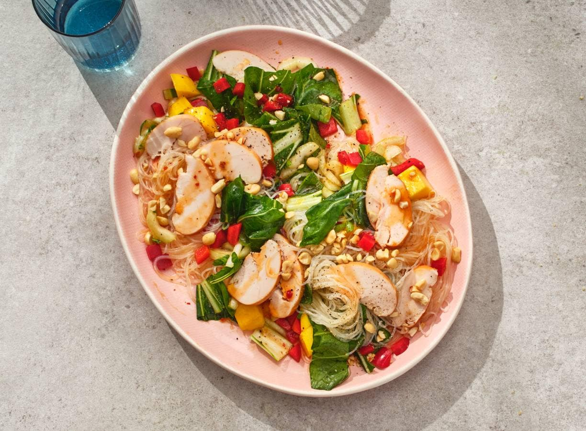

## Maaltijdsalade met kip en paksoi

1. Bereid de noedels volgens de aanwijzingen op de verpakking. Maak ondertussen de paprika schoon en snijd in blokjes. Snijd het witte deel van de paksoi fijn en snijd de rest in stukken van 2 cm. Snijd de mangoblokjes in kleinere stukjes.

2. Boen de limoen schoon, rasp de groene schil en pers de vrucht uit. Snijd de knoflook heel fijn. Meng de olie met de sweet chilisaus, knoflook, sojasaus, sesamolie, het limoensap en -rasp tot een dressing. Breng op smaak met peper en eventueel zout. Hak de pinda’s grof.

3. Schep de noedels om met de groenten, mango, de helft van de kipfilet en de dressing. Verdeel de rest van de gerookte kipfilet erover en bestrooi met de pinda’s.

[de gerecht](https://www.ah.nl/allerhande/recept/R-R1200120/maaltijdsalade-met-kip-en-paksoi)